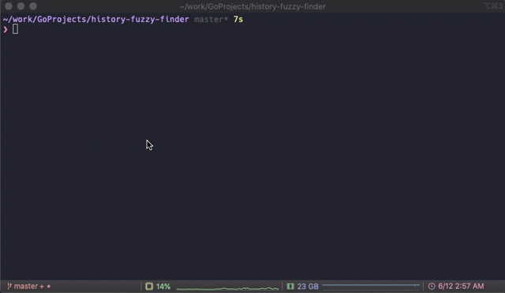

# history-fuzzy-finder

.zsh_history からコマンド履歴を検索する fuzzy finder を Go で作ってみた。



## 試してみる

```
go run main.go | xargs echo
```

## Dependencies

- zsh（.zsh_history からコマンド履歴を検索するので zsh が使われていることが前提）
- [rivo/tview](https://github.com/rivo/tview)（UI 部分は tview で実装）
